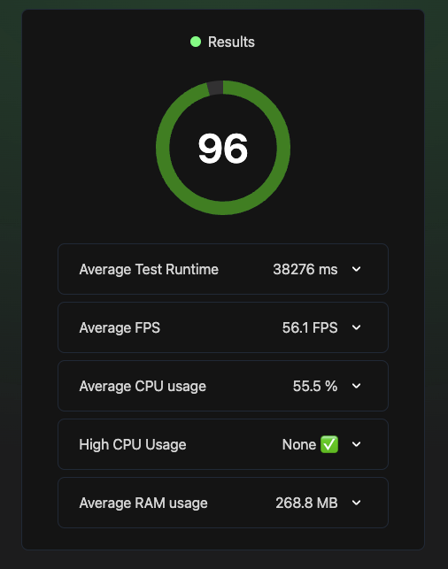

# turborepo-react-native

Project to assess technologies worth investing some research and prototyping efforts in to see if it has potential value-add.

## Table of Contents

- [Overview](#overview)
- [Built With](#built-with)
- [Features](#features)
- [Contact](#contact)
- [Acknowledgements](#acknowledgements)

## Overview

<!-- TODO: Add a screenshot of the live project.
    1. Link to a 'live demo.'
    2. Describe your overall experience in a couple of sentences.
    3. List a few specific technical things that you learned or improved on.
    4. Share any other tips or guidance for others attempting this or something similar.
 -->

### Feature-Sliced Design architectural methodology

Folder structure

```
    .
    ├── apps
    │   └── recipe-app
    │       ├── assets                          # images,lottie
    │       ├── e2e                             # E2E scripts
    │       └── src
    │            ├── app                        # Initializing application logic
    │            │   └── navigation
    │            ├── pages                      # compositional layer to construct full pages from entities, features and widgets
    │            │   ├── home-page
    │            │   └── welcome-page
    │            ├── features                   # user interactions, actions that bring business value to the user
    │            │   └── recipe                 # user filter category, user search recipe
    │            ├── entities                   # business entities
    │            │   ├── page                   # page header
    │            │   ├── recipe                 # api, recipe context, recipe list, recipe category filter
    │            │   │   ├── api                # react-query with placeholder, select logic
    │            │   │   ├── model              # react contexts for recipe filter consumed in features
    │            │   │   └── ui                 # recipe specific UI with slots for features
    │            │   └── user
    │            └── shared                     # reusable functionality, detached from the specifics of the project/business
    │                ├── api                    # generic api
    │                ├── ui                     # empty component UI
    │                └── utils-testing          # integration test helpers
    └── README.md
```

Compositional layer example

```ts
export const HomePage = () => {
  return (
    <FilterRecipeProvider>
      <FilterCategoryProvider>
        <StatusBar barStyle="dark-content" backgroundColor="transparent" />

        {/* RecipeMasonryList from entities with slots for both features and entities */}
        <RecipeMasonryList
          contentContainerStyle={{
            paddingTop: insets.top,
            paddingBottom: insets.bottom,
          }}
          ListHeaderComponent={
            <View style={styles.header}>

              {/* PageHeader (entities) with slots for UserAvatar, UserNotification (entities) */}
              <PageHeader
                StartComponent={<UserAvatar />}
                EndComponent={<UserNotification />}
              />
              <UserGreeting />
              {/* RecipeSearchBar (features) where user interactions will trigger FilterRecipeContext (entities) */}
              <RecipeSearchBar />

              {/* RecipeCategoryFilter (entities) with slots for FilterCategory (features) */}
              <RecipeCategoryFilter
                {/* FilterCategory (features) where user interactions will trigger FilterCategoryContext (entities) */}
                renderItem={category => <FilterCategory {...category} />}FilterRecipeContext (entities)
              />
              <Text
                style={{ fontSize: hp(3) }}
                className="font-semibold text-neutral-600 mx-4 mb-4"
              >
                Recipes
              </Text>
            </View>
          }
        />
      </FilterCategoryProvider>
    </FilterRecipeProvider>
  )
}
```

### General features


### End to End testing


### End to End Performance



## Built With

<!-- TODO: List any MAJOR libraries/frameworks (e.g. React, Tailwind) with links to their homepages. -->

Techniques

- [Feature sliced design](https://feature-sliced.design/)
- Skeleton screens
- Observer pattern
- Motion system [Transition patterns](https://m2.material.io/design/motion/the-motion-system.html#transition-patterns)
- Behavior Driven Development, Test Driven Development
- Performance Driven Development

Platforms

Tools

- [Yarn 3](https://yarnpkg.com/) and workspaces
- [Turborepo](https://turbo.build/)
- [Syncpack](https://github.com/JamieMason/syncpack)
- [React Navigation](https://reactnavigation.org/)
- [NativeWind](https://www.nativewind.dev/) and [clsx](https://www.npmjs.com/package/clsx)
- [React Query](https://tanstack.com/query/v3/) and [Axios](https://github.com/axios/axios)
- [React Native Responsive Screen](https://github.com/marudy/react-native-responsive-screen)
- [React Native Responsive Screen](https://github.com/marudy/react-native-responsive-screen)
- [React Native Reanimated](https://docs.swmansion.com/react-native-reanimated/)
- [React Native Masonry List](https://github.com/hyochan/react-native-masonry-list)
- [Lottie React Native](https://github.com/lottie-react-native/lottie-react-native)
- [react-native-skeleton-placeholder](https://github.com/chramos/react-native-skeleton-placeholder)
- [React Native Testing Library](https://callstack.github.io/react-native-testing-library/), jest, [msw](https://mswjs.io/)
- [Maestro](https://maestro.mobile.dev/), [Flashlight](https://flashlight.dev/)

Languages and frameworks

- [React Native](https://reactnative.dev/)

## Features

<!-- TODO: List what specific 'user problems' that this application solves. -->

User is able to see a list or recipes

User is able to filter by category and search by name

## Contact

<!-- TODO: Include icons and links to your RELEVANT, PROFESSIONAL 'DEV-ORIENTED' social media. LinkedIn and dev.to are minimum. -->

- https://www.linkedin.com/in/anli-su-4b612291/

## Acknowledgements

<!-- TODO: List any blog posts, tutorials or plugins that you may have used to complete the project. Only list those that had a significant impact. Obviously, we all 'Google' stuff while working on our things, but maybe something in particular stood out as a 'major contributor' to your skill set for this project. -->

Credits go to https://www.youtube.com/@codewithnomi for his initial codebase as a reference to build upon
